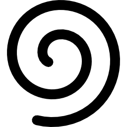

# Curly 
_How restful testing and exploration should be._

# Inspired by 

* [Selenium IDE](http://docs.seleniumhq.org/projects/ide/)
* [GraphicalHTTPClient](https://itunes.apple.com/au/app/graphicalhttpclient/id433095876?mt=12)

# Beta Download

Coming soon

#Attribution

* GradientHelper is based on [ Stavros Kounis "Stavros' Scratchpad"](http://skounis.blogspot.com.au/2008/06/gradient-background-to-any-swt-control.html)
* Toolbar fonts are generated from [ Font Awesome ](http://fortawesome.github.com/Font-Awesome/)
* The Application icon was created using a simple spiral in  [Inkscape](http://www.inkscape.org/)
* The ability to run on the main thread without specifying *-XstartOnFirstThread* is thanks to [Silenio Quarti's code](https://bugs.eclipse.org/bugs/show_bug.cgi?id=389486)
* Correcting the top line of the tree/table header was based on the suggestion here by [gcbrueckmann on stack overflow](http://stackoverflow.com/questions/8263968/nstableheaderview-adds-a-line)
